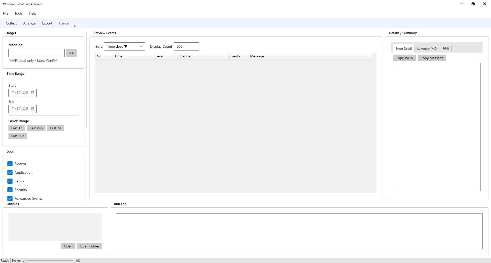
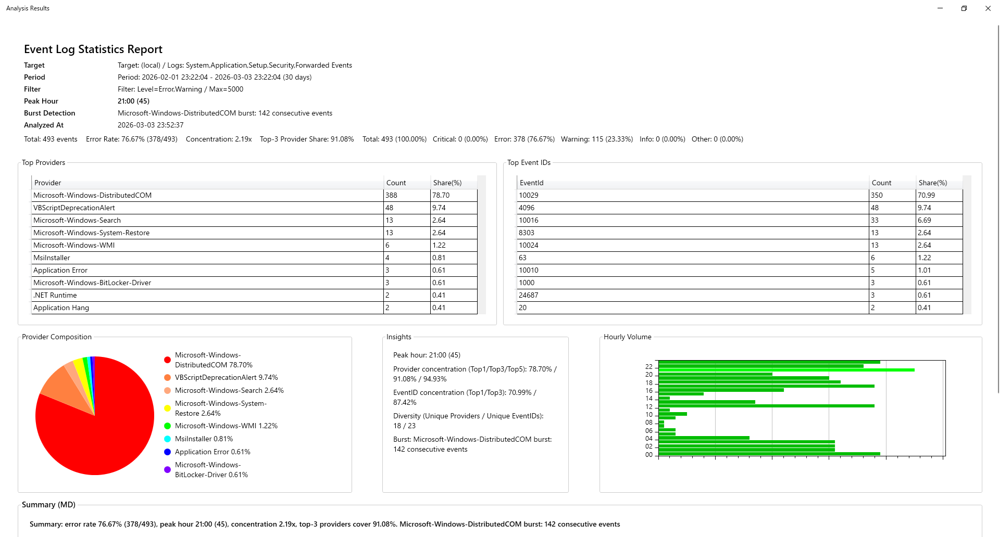
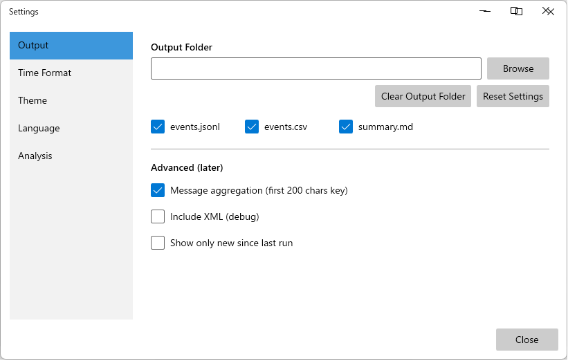

# Event Log Analyzer

A desktop application that extracts, aggregates, and analyzes Windows Event Logs to support troubleshooting.

It primarily targets **System / Application / Security** logs and allows filtering by time range and severity level to assist in root cause analysis.

---

## Overview

This tool is designed to identify trends in errors and warnings occurring on Windows PCs and to streamline root cause investigation.

Originally developed to diagnose issues on personal machines, it is also intended for use in enterprise environments where log analysis and monitoring are required.

---

## Key Features

* Retrieve System / Application / Security logs
* Time range filtering
* Severity-based aggregation (Error / Warning / Information)
* Provider-based and Event ID-based aggregation
* Chronological (time-series) display
* CSV / Markdown export
* Graph-based visualization

---

## Technology Stack

* C#
* .NET
* Windows Event Log API
* WPF (or WinForms depending on the UI implementation)

---

---

## 📷 Screenshots

### ■ Main Window (Event Preview)
Filter logs by machine, time range, and severity level.
The right-side panel allows viewing JSON, message details, and Markdown summaries.

---

### ■ Analysis Report
Automatically aggregates collected data and visualizes:

- Top Providers
- Top Event IDs
- Occurrence ratio (pie chart)
- Hourly distribution (bar graph)
- Auto-generated analysis memo
- Markdown summary export

---

### ■ Settings Window
- Export formats (JSON / CSV / Markdown)
- Output folder selection
- Analysis options
- Multi-language support (Japanese / English)

---

## 🔗 Repository

https://github.com/qtaro-dev/event-log-analyzer

## Intended Use Cases

* Root cause analysis when PC issues occur
* Periodic review of error trends
* Supporting log monitoring for servers and client machines

---

## Development Background

Developed based on long-term experience in PC repair and troubleshooting, where efficient analysis of Windows Event Logs became necessary.

Rather than functioning as a simple log viewer, this tool focuses on aggregation and visualization to clearly understand what events are occurring and how frequently they happen.

---

## Future Enhancements

* Remote log retrieval from other PCs
* Duplicate event detection
* Custom signature registration
* Scheduled report generation

---

## Notes

This is a personal development project.
The application has been tested in Windows environments only.
