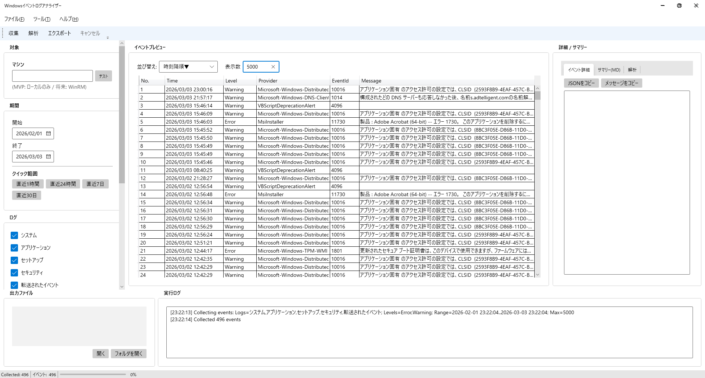
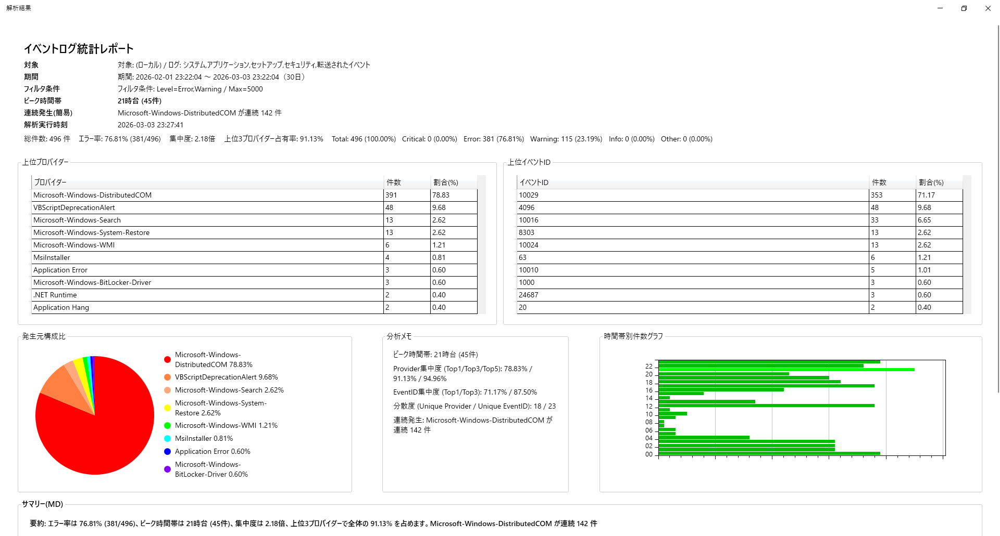
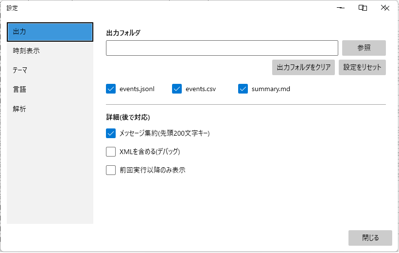

## イベントログアナライザー 

Windowsイベントログを抽出・集計・解析し、トラブルシュートを支援するデスクトップツールです。

主にSystem / Application / Security ログを対象に、期間・レベル別にフィルタリングし、
トラブルシュートを支援することを目的として開発しました。

---

## 概要

本ツールは、Windows PC で発生しているエラーや警告の傾向を把握し、
原因分析を効率化するためのログ解析ツールです。

家庭内PCのトラブル原因特定を目的として開発しましたが、
企業環境におけるログ分析用途も想定しています。

---

## 主な機能

* System / Application / Security ログ取得
* 期間指定フィルタリング
* レベル別集計（Error / Warning / Information）
* Provider別・EventID別集計
* 時系列表示
* CSV / Markdown 出力
* グラフによる可視化

---

## 使用技術

* C#
* .NET
* Windows Event Log API
* WPF（または WinForms ※使用UIに応じて修正）

---
---

## 📷 スクリーンショット

### ■ メイン画面（イベントプレビュー）
ログの収集対象・期間・レベルを指定し、イベントを一覧表示します。
右側の詳細ペインでは JSON / メッセージ / Markdown サマリーを確認可能です。

---

### ■ 解析レポート画面
収集データを自動集計し、以下を可視化します。

- 上位プロバイダー集計
- 上位イベントID集計
- 発生比率（円グラフ）
- 時間帯別発生数（横棒グラフ）
- 自動生成分析メモ
- Markdownサマリー出力

---

### ■ 設定画面
- 出力形式（JSON / CSV / Markdown）
- 出力フォルダ指定
- 解析オプション
- 多言語対応（日本語 / English）

---

## 🔗 GitHub Repository

https://github.com/qtaro-dev/event-log-analyzer

## 想定ユースケース

* PCトラブル発生時の原因特定
* 定期的なエラー傾向の確認
* サーバ・クライアントのログ監視補助

---

## 開発背景

長年PC修理・トラブル対応を行う中で、
Windowsイベントログを効率的に分析できるツールの必要性を感じ開発。

単なるログ閲覧ではなく、集計・可視化により
「何がどのくらい発生しているか」を把握できる設計としました。

---

## 今後の拡張予定

* リモートPCからのログ取得機能
* 重複イベント検出
* カスタムシグネチャ登録
* 定期レポート出力機能

---

## 注意

本ツールは個人開発プロジェクトです。
動作確認は Windows 環境で実施しています。
